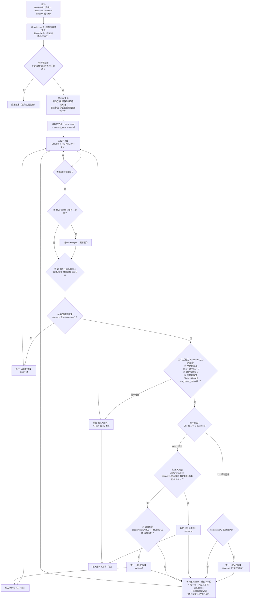

# 自动旁路供电 —— 模块运行判定流程图

> 对应版本：**v12.9（正式版）**
> 本文描述的是**代码里真实存在的判定顺序**，与 `auto_bypass.sh` 主循环一一对应。
> 想核对某一步，直接搜本文里的中文关键字即可在脚本注释里找到同名说明。

---

## 一、总览（Mermaid 版，支持渲染的工具可直接看图）



---

## 二、纯文本版（任何环境都能看）

```
┌─────────────────────────────────────────────────────────────────┐
│ 启动：service.sh（开机）/ bypassctl.sh restart（WebUI、adb）      │
└───────────────────────────────┬─────────────────────────────────┘
                                ▼
      读 nodes.conf（策略唯一来源）+ 读 config.sh（阈值/间隔/DEBUG）
                                ▼
                  ┌─── PID 文件里的进程还活着？ ───┐
                  │ 是                             │ 否
                  ▼                                ▼
        直接退出（已有实例）        写 PID · 移出可冻结 cgroup · 校验参数
                                                   ▼
                        读状态节点 current_cmd → current_state = on / off
                                                   ▼
        ┌──────────────────── 主循环（每 CHECK_INTERVAL 秒一轮）────────────────────┐
        │                                                                          │
        │  ① 读电量 capacity ──── 读不到 ────────────────────────► 睡一轮，重来     │
        │        │ 读到                                                            │
        │        ▼                                                                 │
        │  ② 状态节点值与缓存不一致？ ── 是 ──► 记 state resync，更新缓存           │
        │        │ 否                                                              │
        │        ▼                                                                 │
        │  ③ 读 ibat、usb/online（DEBUG=1 时额外读 usb_in/cp/type 并打 tick）      │
        │        ▼                                                                 │
        │  ④ state=on 且 usb/online=0 ？                        ← 充电器被拔掉      │
        │        │ 是 ──► 【退出序列】state=off ──────────────────────► 睡一轮     │
        │        │ 否                                                              │
        │        ▼                                                                 │
        │  ⑤ state=on 且冷却已过，且下面【任一】成立 ← 保活（v12.2 扩到三条）        │
        │      ① 电池仍在充（ibat < -150mA）      → 泵又抢回去了 / PD 重新快充      │
        │      ② 锁定节点 night_charging ≠ 1       → 压泵能力被改掉了              │
        │      ③ 只做到停充：ibat > +30mA 且 en_power_path ≠ 1                     │
        │         → 电池在给系统供电，说明"真旁路"没成（v12.2 新增）                │
        │        │ 任一成立 ──► 重打【进入序列】+ 记 last_apply_tick ──► 睡一轮     │
        │        │ 都不成立                                                        │
        │        ▼                                                                 │
        │  运行模式？（mode 文件）                                                  │
        │        │                                                                 │
        │        ├── on 手动旁路 ──► usb/online≠0 且 state≠on ？                    │
        │        │                      │ 是 ──► 【进入序列】（**无视阈值**）        │
        │        │                      │ 否 ──► 什么都不做                        │
        │        │                                                                 │
        │        └── auto 自动 ────► ⑥ usb/online≠0 且 capacity≥ENABLE 且 state≠on ？│
        │                              │ 是 ──► 【进入序列】state=on                │
        │                              │ 否                                       │
        │                              ▼                                          │
        │                           ⑦ capacity≤DISABLE 且 state≠off ？             │
        │                              │ 是 ──► 【退出序列】state=off              │
        │                              │ 否 ──►                                    │
        │                              ▼                                          │
        │  ⑧ nap_watch：睡到下一轮（5 秒一步；旁路态下盯 usb/online，掉线提前返回； │
        │                收到 USR1 —— 即 WebUI 切换模式 —— 也立刻返回）            │
        └──────────────────────────────────┬───────────────────────────────────────┘
                                           └────────────► 回到 ①
```

### 二·补 运行模式（v12.1）

模式存在 `/data/adb/bypass_charger/mode`，内容就是 `auto` 或 `on` 两个词。
**文件不存在或内容不认识，一律按 `auto` 处理**（所以删掉它 = 回到自动）。

| 模式 | 谁决定进/出旁路 | 进入条件 | 退出条件 |
|---|---|---|---|
| `auto`（默认） | 按配置阈值自动 | `usb/online≠0` 且 `capacity ≥ ENABLE_THRESHOLD` | `capacity ≤ DISABLE_THRESHOLD` |
| `on`（手动旁路） | 用户，**无视阈值** | `usb/online≠0`（只要插着就保持旁路） | 只有三种：**拔充电器** / **切回 auto** / 卸载或重启 |

两种模式**都保留**：拔充电器退出（④）、保活重打（⑤）、"没充电器不进旁路"、以及写入前的解锁/写入后的上锁。

切换方式：
- WebUI「手动操作」卡片：**自动** / **开启旁路** 两个按钮
- 命令行：`bypassctl.sh mode auto` / `bypassctl.sh mode on`

**切换是立刻生效的**：命令写完模式文件后会给守护进程发 `USR1`，
`nap_watch` 检查到 `WAKE=1` 就立刻返回主循环重新判定 —— 不用等满一轮 60 秒。
（实测：`23:47:31` 执行 `mode on`，日志同一秒记下 `模式切换：auto -> on`。）

---

## 三、【进入序列】—— 3 个写入，覆盖全部场景

```
第 1 写: current_cmd    = "0 1"   ← 状态判据；泵闲着时（<80% 的 5V 直充、≥89% 泵已停）由它干活
第 2 写: night_charging = "1"     ← ★ 压泵：电量 ≥80% 时 MIUI 框架立刻停充，泵没负载自己就停
         └─ 写入成功后 chmod 440 上锁（防止 MIUI 以 system 身份把它改回 0）
第 3 写: en_power_path  = "1"     ← 使能主电源路径：把「停充」升级成「真旁路」(ibat=0)

每一次写入都按【读回值】判成败（见『五』）：
  任一写入最终读回不符 → 记 ACTION FAILED → run_actions 返回非 0
                      → current_state 不更新，下一轮（或冷却后）自动重试

写完并判定成功后，还会**睡 10 秒做一次复核**（v12.2）：
  这 10 秒正好是主电源路径接管系统负载的收敛窗口（实测约 10 秒）。
  复核判据与保活的第 ③ 条相同 —— 若此刻"电池仍在供电"（ibat>+30mA 且
  en_power_path≠1），就**幂等地再写一遍**这个序列，把停充纠正成真旁路。
```

## 四、【退出序列】—— 2 个写入，**顺序不能反**

```
第 1 写: night_charging = "0"   ← 必须先释放！否则框架会把充电永久卡在 80% 不再往上充
         └─ 写之前先 chmod 644 解锁（440 连 root 都写不进去，见『五』）
第 2 写: current_cmd    = "0 0" ← 恢复充电
```

## 五、写入单个节点的判定（`write_node`）

```
┌ 目标节点在 LOCK_NODES 里吗？
│   是 → 先 chmod 644 解锁
│         （原因：chmod 440 之后连我们自己都写不进去 ——
│           ksu 的 root 有 CAP_FOWNER 能 chmod，但没有 CAP_DAC_OVERRIDE，
│           往 440 的文件里写会直接 Permission denied。酷安原帖
│           "关的时候先 chmod 660 再写 0" 就是这个道理）
▼
写值 → 立即读回
   │
   ├─ 读回 == 期望值 ──────────────► 成功
   │     └─ 若 write 本身报了错（如该节点返回 Invalid argument）：DEBUG=1 时记一条
   │        「ACTION note: 写报错(rc=…)但读回已是 '…'，按成功计」
   │
   └─ 读回 != 期望值 → 等 1 秒再读，共重试 2 次
         ├─ 其中某次读回对上了 ──► 成功
         └─ 3 次都不符 ──────────► 记「ACTION FAILED: '值' -> 节点 (写 rc=… 读回='…')」
                                   返回失败（run_actions 会返回非 0）
成功且「节点是锁定节点」且「写入的是 1」→ chmod 440 上锁
```

## 六、判定用到的节点与阈值一览

| 判定 | 读什么 | 条件 |
|---|---|---|
| ① 电量 | `battery/capacity` | 读不到就跳过这一轮 |
| ② 当前状态 | `/proc/mtk_battery_cmd/current_cmd` | `"0 1"`=on（旁路）、`"0 0"`=off |
| ③ 电流 | `battery/current_now` | 内核约定：充电为负、放电为正 |
| ③ 充电器 | `usb/online` | `0`=没插充电器 |
| **模式** | `/data/adb/bypass_charger/mode` | `auto`（默认）/ `on`；读不到或内容不认识 = `auto` |
| ④ 拔充电器 | `usb/online` | `state=on` 且读到 `0` → 退出旁路（**两种模式都做**） |
| ⑤ 保活－还在充 | `battery/current_now` | `< -150000`（−150 mA，`INEFFECTIVE_IBAT`）且 `usb/online=1` |
| ⑤ 保活－掉锁 | `LOCK_NODES` 里的节点 | 值不是 `1` |
| ⑤ 冷却 | 轮数计数器 | 距上次重打 ≥ `REAPPLY_COOLDOWN(90s)/CHECK_INTERVAL` 轮；**本次启动后首轮不受限制** |
| ⑥ 进入（auto） | `battery/capacity` + `usb/online` | `≥ ENABLE_THRESHOLD` 且 `usb/online ≠ 0` |
| ⑥ 进入（on） | `usb/online` | 只要 `≠ 0`（**无视阈值**） |
| ⑦ 退出（auto） | `battery/capacity` | `≤ DISABLE_THRESHOLD`（`on` 模式下没有这一条） |
| ⑧ 等待 | `usb/online`、`WAKE` | 每 5 秒看一眼；读到 `0`（拔了）或 `WAKE=1`（收到 USR1）就提前返回主循环 |

## 七、配置项一览（`/data/adb/bypass_charger/config.sh`）

| 键 | 默认 | 含义 | 限制 |
|---|---|---|---|
| `ENABLE_THRESHOLD` | 95 | 充到多少开始旁路 | 原装 PD 快充头下**实际下限 80**（低于 80 会被框架兜到 80）；5V 慢充无限制 |
| `DISABLE_THRESHOLD` | 80 | 掉到多少恢复充电 | 无限制（必须小于 ENABLE） |
| `CHECK_INTERVAL` | 60 | 轮询间隔（秒） | 最小 5 |
| `DEBUG` | 0（正式版） | 1 = 每轮打一条 `tick` 详细日志 | 排查问题时可开 |

> 运行模式不在 `config.sh` 里，而在同目录的 **`mode`** 文件（内容 `auto` / `on`），
> 由 WebUI 的「手动操作」或 `bypassctl.sh mode auto|on` 改写。

> 阈值是"**到点才开始旁路**"，不会把已经高于阈值的电量放下来。
